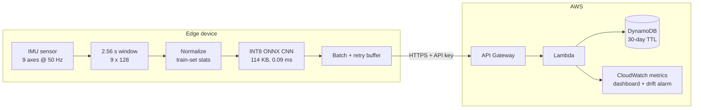

# Edge AI Human Activity Recognition (IMU time series)

> A 1-D CNN classifies six daily activities from raw smartphone accelerometer and gyroscope signals.
> The model is exported to **ONNX Runtime**, **INT8-quantized** for edge devices, and sends its predictions
> to an **AWS-hosted monitoring API**. All results are **leak-free**: every model is scored on people it never saw during training.


## Architecture



## Results

### Edge model: raw IMU time series, 1-D CNN (107k parameters)

| Evaluation | Accuracy | Macro-F1 |
|---|---|---|
| Subject-wise 5-fold CV (21 training subjects) | **91.5% ± 4.4%** | 91.8% ± 4.4% |
| Official test set (9 unseen subjects) | **93.8%** | 94.0% |

The hardest classes are sitting and standing (F1 ≈ 0.83). The other four activities score F1 0.98–1.00.

### INT8 post-training quantization (ONNX Runtime, 1 CPU thread)

| Model | File size | Weights | Latency / window | Test accuracy | Test macro-F1 |
|---|---|---|---|---|---|
| FP32 ONNX | 417 KB | 413 KB | 0.29 ms | 93.79% | 93.96% |
| **INT8 ONNX** | **114 KB** | **103 KB** | **0.09 ms** | **93.69%** | **93.87%** |
| | 3.7× smaller | **4.0× smaller** | **3.2× faster** | −0.1 pt | FP32/INT8 agreement 99.8% |

Numbers are reproduced by `python src/benchmark.py` and saved in `models/benchmark.json`.

### Classical baseline: 561 engineered features ([notebook](notebooks/har_classical_baseline.ipynb))

| Model | Features | Subject-wise CV | Test accuracy |
|---|---|---|---|
| SVM (RBF) | PCA-100 | 91.0% ± 3.9% | 93.65% |
| Fully-connected NN | PCA-100 | 90.7% ± 5.1% | 93.5% |
| 1-D CNN | PCA-100 | 87.3% ± 4.6% | 90.7% |
| SVM (RBF) | PCA-30 | – | 89.4% |
| SVM (RBF) | Top-30 RF features | – | 87.7% |

The raw-signal CNN matches the best engineered-feature pipeline without hand-crafted features. That makes it
practical on a device where computing the 561 UCI features isn't feasible.

## Leak-free evaluation protocol

Windows from the same person are highly correlated, and UCI HAR windows overlap by 50%. A random split
therefore puts near-duplicates in both train and validation. An earlier version of this project did that
and also applied SMOTE before splitting, which reported **97% validation accuracy**. The protocol below
drops that to the honest **91%**.

- **Subject-wise splits everywhere.** CV uses `StratifiedGroupKFold` grouped by subject ID. The early-stopping
  set is a further subject-wise split *inside* each training fold, so the scored subjects never influence training.
- **Preprocessing is fitted on training data only.** That covers normalization statistics, scaler/PCA/feature
  selection (sklearn `Pipeline`s), and INT8 calibration windows.
- **No oversampling.** The classes are already close to balanced (986–1,407 windows).
- **The test set is used once.** The final model trains on all 21 training subjects for the median best CV epoch
  and is evaluated on the 9 held-out subjects.
- **Tests enforce it.** `tests/test_pipeline.py` asserts disjoint subjects and checks FP32/INT8 agreement.

## Repository structure

```
src/
  data.py            raw Inertial Signals loader (9 x 128 windows) + normalization
  model.py           1-D CNN
  train.py           subject-wise CV + final model
  export_onnx.py     PyTorch -> ONNX with numerical parity check
  quantize.py        INT8 static PTQ (QOperator, per-channel, train-only calibration)
  benchmark.py       FP32 vs INT8 size / latency / accuracy
  edge_client.py     on-device inference + batched upload to the monitoring API
aws/
  template.yaml      SAM stack: API Gateway (API key), Lambda, DynamoDB, CloudWatch dashboard + alarm
  src/lambda_function.py
app.py               Streamlit demo on the ONNX model
models/              deployable ONNX models, normalizer, metrics
notebooks/           classical baseline (leak-free) + original notebook
tests/               leakage, quantization and Lambda tests
```

## How to run

```bash
pip install -r requirements.txt
# Download the UCI HAR Dataset into data/ (creates data/UCI HAR Dataset/)
curl -L -o data/har.zip "https://archive.ics.uci.edu/static/public/240/human+activity+recognition+using+smartphones.zip"
cd data && unzip har.zip && unzip "UCI HAR Dataset.zip" && cd ..

python src/train.py          # subject-wise CV + final model  (~12 min on a laptop CPU)
python src/export_onnx.py    # -> models/har_fp32.onnx
python src/quantize.py       # -> models/har_int8.onnx
python src/benchmark.py      # FP32 vs INT8 table
pytest tests

streamlit run app.py         # interactive demo
```

Pre-built models are committed in `models/`, so the app and the edge client work without retraining.

### Monitoring API (AWS)

```bash
cd aws && sam build && sam deploy --guided           # stack name e.g. edge-har-monitoring
aws apigateway get-api-key --api-key <ApiKeyId> --include-value --query value --output text
cp .env.example .env                                 # fill in HAR_API_URL and HAR_API_KEY
python src/edge_client.py --n 300 --rate 20          # stream predictions to the API
```

The Lambda stores each prediction in DynamoDB and publishes `Confidence`, `LatencyMs`, per-activity
`Predictions` and (in replay mode) `Correct` metrics to CloudWatch. A dashboard and a low-confidence alarm
serve as a simple drift signal. Remove everything with `sam delete`.

## Dataset

[UCI Human Activity Recognition Using Smartphones](https://archive.ics.uci.edu/dataset/240/human+activity+recognition+using+smartphones):
30 subjects, Samsung Galaxy S II on the waist, 50 Hz accelerometer and gyroscope, 10,299 windows
(7,352 train / 2,947 test, subject-disjoint), 6 activities.

## Author
Yeşim Nur Tortop · [GitHub](https://github.com/YesimNurT)
