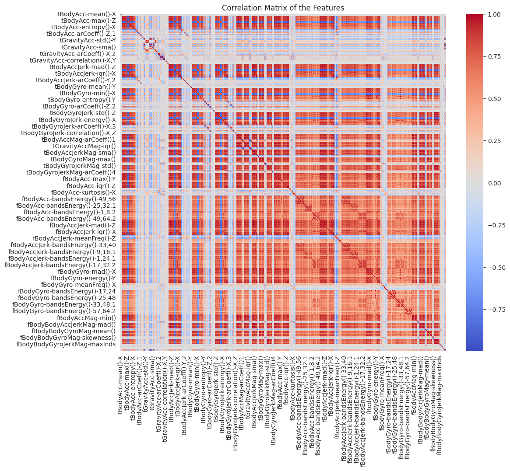

# Human Activity Recognition (Smartphone IMU)

> Six-class activity recognition from smartphone accelerometer/gyroscope features, with classical ML, deep learning, and an interactive Streamlit app.


<p align="center"></p>

## Overview
Classifies six daily activities (laying, sitting, standing, walking, walking upstairs/downstairs)
from smartphone IMU features. The updated notebook also fixes a StandardScaler/PCA data-leakage bug
that had inflated validation accuracy while real test accuracy was poor.

## Results
| Model | Features | Test accuracy |
|-------|----------|---------------|
| **SVM** | PCA-100 | **93.8%** |
| SimpleNN | PCA-100 | 93.6% |
| 1D-CNN | PCA-100 | 91.3% |

Hardest pair: sitting vs. standing.

## Approach
- **Preprocessing:** StandardScaler + PCA (100 / 30 components), SMOTE oversampling.
- **Models:** SVM (RBF), a fully-connected SimpleNN, and a 1D-CNN; Random Forest feature-importance analysis.
- **Validation:** stratified 5-fold CV for the neural models.
- **App:** `app.py` Streamlit dashboard for inference on uploaded CSV sensor files.

## Dataset
UCI Human Activity Recognition with Smartphones — 7,352 train / 2,947 test samples, 561 features,
30 subjects, 6 activities.

## Tech stack
scikit-learn · imbalanced-learn · PyTorch · Streamlit · pandas · seaborn

## Repository structure
```
humanactivity-recognition-update.ipynb   # main cleaned pipeline
HumanActivityClassification.ipynb         # original notebook
app.py                                    # Streamlit dashboard
```

## How to run
```bash
pip install -r requirements.txt   # or: scikit-learn imbalanced-learn torch streamlit
streamlit run app.py
```
> Note: `app.py` expects a trained `best_model_CNN.pth`; train it from the notebook first (it is gitignored).

## Author
Yeşim Nur Tortop · [GitHub](https://github.com/YesimNurT)
